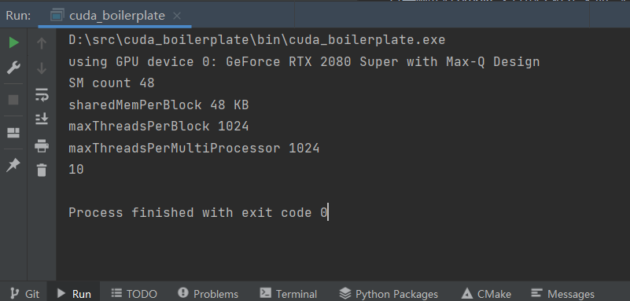

# 概述

对一些运算特别密集的任务，并且计算任务可以很好地并行化的，也就是可以分解为互相之间不依赖的子任务的，可以考虑用cuda来完成，改造的收益还是很可观的，GPU的线程数吊打CPU。

# 改造过程

## 安装cuda框架

直接官网下载安装包安装cuda toolkit即可。

## 工程中指明支持cuda相关文件，也就是cu和cuh

其实就是在cmake文件的工程定义那一行，注明语言支持cuda。

```cmake
project("${PROJECT_NAME}" LANGUAGES CXX CUDA)
```

## 编写cuh和cu文件，在里面编写核函数

一个简单的核函数示例

```c++
__global__ void cu_dot(Eigen::Vector3d *v1, Eigen::Vector3d *v2, double *out, size_t N)
{
    int idx = blockIdx.x * blockDim.x + threadIdx.x;
    if(idx < N)
    {
        out[idx] = v1[idx].dot(v2[idx]);
    }
    return;
}
```

示例工程地址 https://github.com/northward111/cuda_boilerplate

运行结果如下：



# 注意事项

核函数中不能直接调用host函数，因为核函数最终是要在gpu中运行的，支持的操作有限。

核函数中用到的数据必须转存储到device内存中，不能直接访问host内存。

核函数的函数声明中，参数需要用到引用的，写成指针的形式。

核函数中不支持std::vector，所以要转成数组再使用。

Eigen库的cuda支持还是比较好的，大部分常用函数都可以在核函数中正常运行，虽然编译过程中会有一些warning，但是实际上不影响运行。

核函数内部不要再动态申请内存，因为同一时间同时运行的核函数有可能有很多很多，会导致申请内存过多，报OOM错误，可以事先在调用核函数之前，将需要用到的内存统一申请好，核函数找到分配给自己的那一段进行运算即可。如果计算量过大，一次申请超出物理内存（显存），可以分批次进行运算。

核函数内部逻辑尽量简单，尽量不要再在里面嵌套一些循环了。